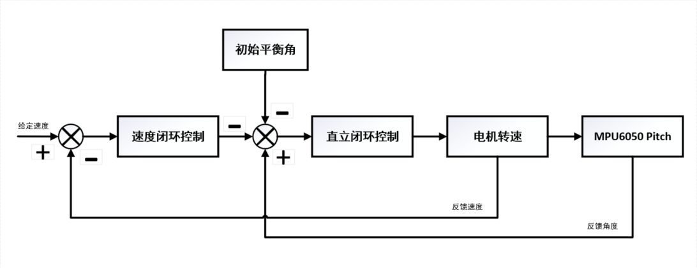
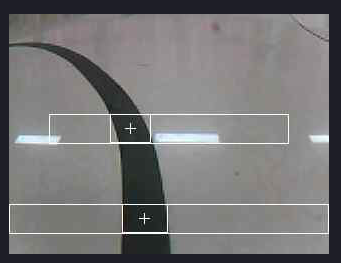

# 平衡小车+循迹

基于 STM32F103C8T6 OpenMV MPU6050 的平衡循迹小车

<!-- vscode-markdown-toc -->
* 1. [速度闭环和直立闭环](#)
* 2. [循迹](#-1)
* 3. [通信格式](#-1)
* 4. [展示](#-1)
* 5. [未来改进](#-1)
	* 5.1. [算法部分](#-1)
	* 5.2. [控制部分](#-1)

<!-- vscode-markdown-toc-config
	numbering=true
	autoSave=true
	/vscode-markdown-toc-config -->
<!-- /vscode-markdown-toc -->

##  1. <a name=''></a>速度闭环和直立闭环

采用双闭串联环控制



MPU6050 采用DMP硬解，四元数， 转欧拉角 得到roll，pitch，yaw

##  2. <a name='-1'></a>循迹

openMV 阈值化 色块查找 得到 x1、x2（两块roi里面的色块中心位置的x轴坐标）



循迹的前进逻辑是 x1与x2 相差越大 l(直行)速度越小

循迹的旋转逻辑是 只看x1或者只看x2(x1未识别到) 与图像中心位置的距离越小 s(旋转)越小

若x1与x2都未识别到，该车保持上一个状态

##  3. <a name='-1'></a>通信格式

标志位|第二位|第三位|第四位|第五位|
:-:|:-:|:-:|:-:|:-:
55|x1高八位|x1低八位|x2高八位|x2低八位

##  4. <a name='-1'></a>展示


##  5. <a name='-1'></a>未来改进

###  5.1. <a name='-1'></a>算法部分

```bash
1，尝试着目标跟踪

2，尝试 激光雷达 SLAM ROS 深度摄像头
```

###  5.2. <a name='-1'></a>控制部分

```bash
1，尝试FOC，驱动部分自己打板

2，降低重心

3，优化参数

```
